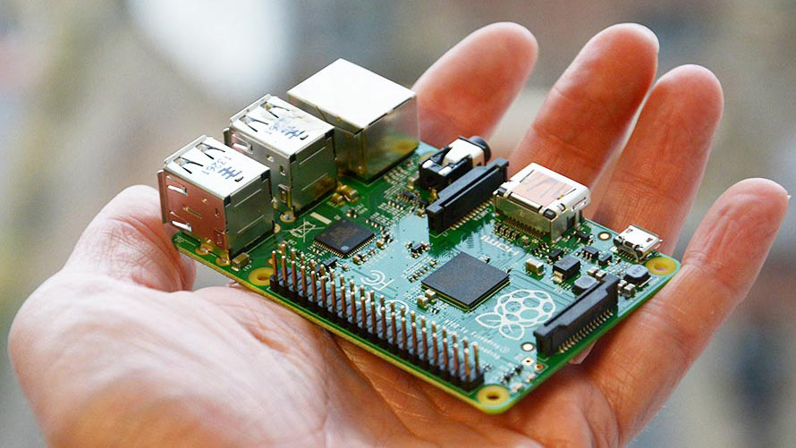
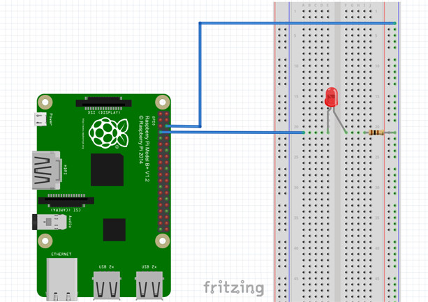
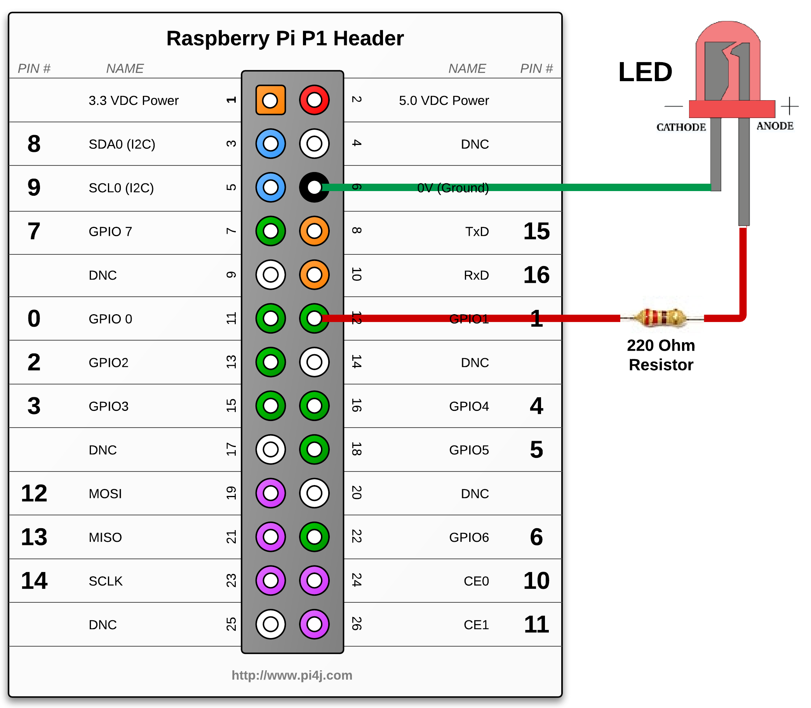
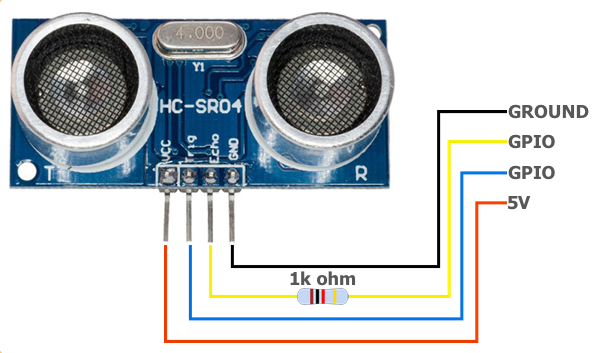
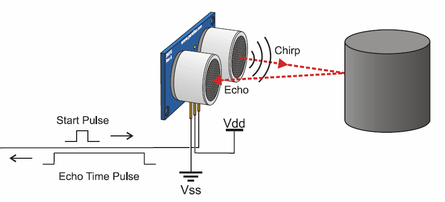
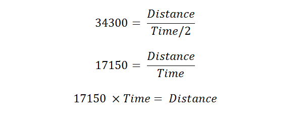
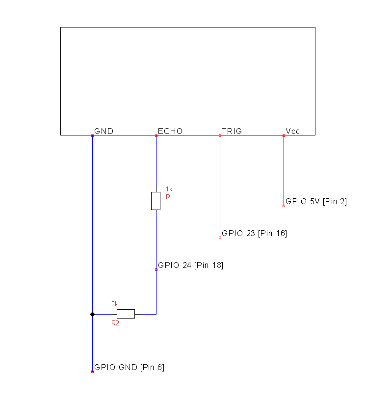
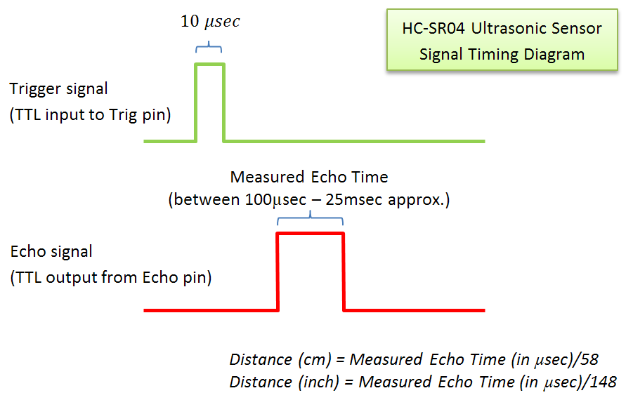
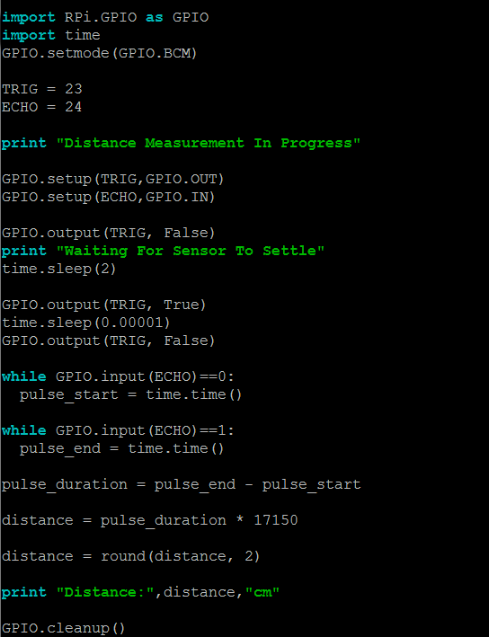

## Piece of Pi

Python Programming with Raspberry Pi


<div style="font-size:70%;font-style:italic">Aaron Xiang</div>
<div style="font-size:50%;font-style:italic">Computer Science Club</div>
<div style="font-size:50%;font-style:italic">5/6/17</div>

---

### What is Raspberry Pi

* Credit card size computer               <!-- .element: class="fragment" -->
* Linux Operating System                  <!-- .element: class="fragment" -->
* General Purpose Input Output (GPIO)     <!-- .element: class="fragment" -->
* Suited for IoT projects                 <!-- .element: class="fragment" -->

---

### Computer in Palm



---

### Raspberry Pi Circuit Board Layout


---

### Controlling Light-emitting Diode (LED)



---

### LED Control GPIO Configuration



---

### LED Control Programming (Python)

```python
import RPi.GPIO as GPIO   ## Import GPIO library
import time               ## Import time library

GPIO.setmode(GPIO.BCM)    ## Use Broadcom pin numbering
GPIO.setup(1, GPIO.OUT)   ## Setup GPIO Pin 1 to OUTPUT mode

## Blink LED 3 times
for i in range(3):
    GPIO.output(1, GPIO.HIGH)   ## Turn on GPIO pin 1
    time.sleep(1000)            ## Wait 1 second
    GPIO.output(1, GPIO.LOW)    ## Turn on GPIO pin 1
    time.sleep(1000)            ## Wait 1 second

GPIO.cleanup()    ## Reset all GPIO pins
```

---

### Ultrasonic Distance Sensor 
#### (HC-SR04)



---

### How Distance Sensor Works



---

### Distance Calculation

Speed of sound: 343 m/s




---

### HC-SR04 Wiring Diagram



---

### HC-SR04 Timing Diagram



---

Distance Sensor Python Code



--- 

### The End

---